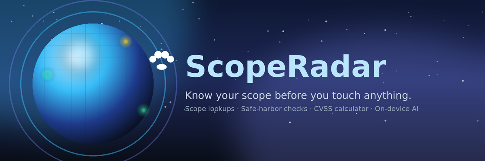
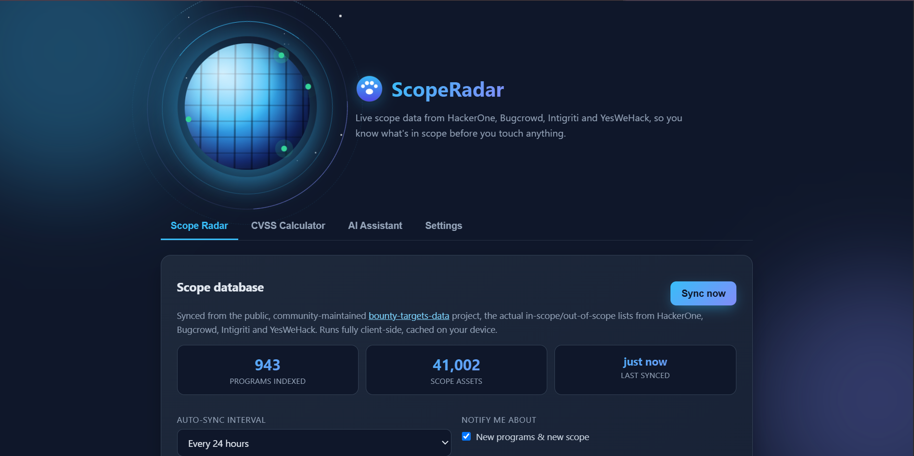

<p align="center">
 
</p>

<p align="center">
 
 
 
 
</p>

# ScopeRadar: Bounty Scope & Outreach

**Find scope. Ask permission. Get paid.**

ScopeRadar is a Chrome extension for bug bounty hunters. It syncs the real
public bounty scope lists (HackerOne, Bugcrowd, Intigriti, YesWeHack) so it
can tell you, instantly, whether a host is **in scope**, **explicitly
out of scope**, or **unlisted**: plus a full outreach workflow, a real
CVSS calculator, and free on-device AI writing help.

> **Legal note:** Testing a website for vulnerabilities without
> authorization is illegal in most jurisdictions, even with good intent.
> ScopeRadar never scans or attacks anything automatically. Radar matching
> and recon are read-only lookups against public data; only test what a
> program's scope (or a company's written permission) actually covers.

| Popup (on any website) | Dashboard |
|---|---|
|  |  |

## Quick Start

1. **Install it**: see [Install](#install-load-unpacked) below (takes ~1 minute)
2. **Sync the scope database**: open the dashboard → Scope Radar tab → **Sync now** (one-time, downloads the public program list)
3. **Browse normally**: the toolbar badge tells you at a glance:
 - green = confirmed program / you're in scope
 - ! orange = the company has a program, but this exact host isn't in it
 - amber = no known program
 - ? grey = not synced yet
4. **On a site with no program?**: open the popup → it drafts a permission-request email for you to review and send yourself
5. **Got a finding?**: use the CVSS Calculator tab to score it, and the AI Assistant tab if you want help wording the report

## Features

### Scope Radar
- **Real scope database**: syncs the public, community-maintained
 [`bounty-targets-data`](https://github.com/arkadiyt/bounty-targets-data)
 project: every HackerOne/Bugcrowd/Intigriti/YesWeHack program's actual
 in-scope and out-of-scope assets (900+ programs, 40,000+ scope entries).
 ETag-cached, so repeat syncs only download what changed.
- **Out-of-scope warnings**: a bright red banner the moment you land on
 a host a program has explicitly excluded.
- **New-scope alerts**: a background diff on every sync surfaces newly
 launched programs and newly added scope, with an extra notification if
 it touches a domain you're already tracking.
- **Right-click → "check this link's/site's scope"** context menu.
- **"Check a specific host"** box in the dashboard for offline lookups.
- **Browse every synced program**: a searchable, filterable (platform,
 bounty-only) list of all 900+ programs currently in the local database,
 each linking straight to its page.

### Safe harbor & compliance
- **Safe-harbor detector**: scans a program's policy text (rendered
 DOM, so it works on JS-heavy pages) for legal-protection language *and*
 for language reserving the right to sue, so you see both sides at a
 glance. Heuristic, not legal advice.
- **security.txt panel**: Contact/Policy/Expires/Encryption/etc., with
 an **expired** flag when the file is stale.
- **Consent gate**: you must confirm written permission before marking
 a domain "Testing".

### Outreach (in the popup)
- **Permission-request drafting**: editable subject/body, opened in
 your own mail client (`mailto:`). **Nothing is ever sent automatically.**
- **Spam guard**: warns before you re-contact a domain too soon.
- **Follow-up reminders**: browser notifications after 7/14/30 days.
- The template and your researcher profile live in the dashboard's
 **Settings** tab; the per-site drafting, status, and notes happen right
 in the popup when you're on that site.

### CVSS calculator
- **CVSS v3.1 base score calculator**: the real FIRST.org formula
 (verified against an independent implementation across all 2,592 base
 metric combinations), click-to-build vector, one-click copy.

### AI Assistant (free, built into Chrome, no key ever)
- A real chat tab, not just a status light: ask it anything bug-bounty
 related: explaining a vulnerability class, how to word a finding,
 what a program's scope language means, CVSS reasoning, and so on.
 Multi-turn (it remembers the conversation until you start a new one).
- Runs on Chrome's own **on-device model** (Gemini Nano via the Prompt
 API), entirely **locally on your machine**: no API key, no account,
 no sign-up, nothing sent to any server. Needs Chrome 131+ on desktop;
 the AI Assistant tab shows availability and can trigger the one-time
 model download if needed.
- Scoped on purpose: it won't write exploit code or attack instructions,
 and in the popup's outreach helper it only polishes wording. It never
 invents technical details that weren't already in your draft.

### Passive recon
- Subdomain enumeration via certificate-transparency logs (crt.sh):
 public third-party records only, no requests sent to the target itself.

### Privacy
- The automatic tab badge uses **local data only** (the synced radar index
 + a small curated list). Visiting a site does not trigger any network
 request. Deeper checks (security.txt, safe-harbor, recon) only run when
 you open the popup or click a button.
- Everything lives in `chrome.storage` on your machine. No ScopeRadar
 server, no telemetry, no external AI API either.

## Install (Load Unpacked)

```
scopehound-extension/
├── manifest.json
├── background.js
├── radar.js : Scope Radar matching engine
├── cvss.js : CVSS v3.1 calculator
├── safeharbor.js : safe-harbor language detector
├── ai.js : on-device AI helper (no key)
├── popup.html / popup.css / popup.js
├── options.html / options.css / options.js
├── icons/
├── LICENSE
└── README.md
```

1. Open Chrome → `chrome://extensions/`
2. Enable **Developer mode** → **Load unpacked** → select this folder
3. Open the dashboard (click the icon → "Open dashboard") → **Scope Radar**
 tab → **Sync now** (one-time download of the public scope database, ~19 MB)
4. Browse normally. The badge updates from local data; open the popup on
 any site for the full scope/outreach/recon breakdown

## Badge legend

| Badge | Meaning |
|---|---|
| green | Confirmed program / host is in scope |
| ! orange | Program exists but this host isn't in its scope (or is explicitly excluded, check the popup) |
| amber | No known program |
| ? grey | Scope database not synced yet |

## Setting up outreach

1. Dashboard → **Settings** → fill in your researcher name/email
2. (Optional) Edit the outreach email template
3. Browse to a site with no program → popup shows **"Request permission"**
 → edit the draft → **Open in mail app** → review → send it yourself

## Using the free AI Assistant

1. Dashboard → **AI Assistant** tab: shows whether the on-device model
 is ready
2. If it says "needs a one-time download," click the button. Chrome
 downloads its on-device model (a few GB) once, in the background
3. Type any bug-bounty-related question into the chat box. No key, no
 sign-up, ever. Use **New conversation** to clear context.
4. Separately, ** Polish with AI** in the popup's outreach draft uses the
 same on-device model to tidy up your email wording.

## Data sources & credit

- Scope data: [arkadiyt/bounty-targets-data](https://github.com/arkadiyt/bounty-targets-data)
 (MIT-licensed, community-maintained sync of public program scopes)
- Subdomain recon: [crt.sh](https://crt.sh) certificate-transparency search
- CVSS: [FIRST.org CVSS v3.1 specification](https://www.first.org/cvss/v3.1/specification-document)
- AI: Chrome's built-in on-device model (Gemini Nano / Prompt API)

## Responsible use

- Always get **written** permission (or rely on an explicit, in-scope
 bounty program) before testing anything.
- Respect scope, rate limits, and exclusions exactly as published.
- Report findings privately first; never disclose publicly without consent.
- This tool contains no scanning, exploitation, or automated-attack code,
 and never sends email without you clicking "send" yourself.

## Protecting this code before you publish it on GitHub

Being honest about what actually works here, since "encrypting" client-side
code is a common but false promise:

- **You can't hide it.** A browser extension's JS has to run in the user's
 browser in plain, readable form. That's true for every extension that
 has ever existed, including ones from large companies. Minifying or
 "obfuscating" the code makes it harder to *casually skim*, not
 impossible to read, and it makes the project harder for *you* to
 maintain and for contributors to trust. It is not real security, so this
 project intentionally ships readable.
- **What actually protects you is copyright + a record of authorship,**
 not obfuscation:
 - The included `LICENSE` file states your terms. Even a strict
 "all rights reserved" license doesn't stop someone from reading the
 code, but it does give you a clear legal basis if someone redistributes
 it or claims it as their own.
 - Your GitHub commit history is timestamped, signed to your account, and
 very hard to fake. It's your strongest evidence of original
 authorship if authorship is ever disputed.
 - Put your name/handle and a link back to your repo in the `README` and
 in a comment at the top of the main files (already done here).
- **If you want fewer people casually copy-pasting it:** keep the repo
 private, or publish only a compiled/minified build as a release asset
 while keeping source in a private repo. Legitimate, but again, not
 encryption, just reduced convenience for a casual copier.
- **What this project deliberately avoids:** any claim that the code is
 "encrypted" or "protected" from being read once installed. If you see
 another project claiming that for a browser extension, that claim isn't
 accurate.

## Author

Built by **Muhammad Rebaal**.
GitHub: [github.com/iamzeropoison](https://github.com/iamzeropoison)

Questions, feedback, or want to use this beyond what the license covers?
Open an issue on this repo, or reach out directly: contact **muhammad-rebaal**
on GitHub.

## License

See `LICENSE`.
